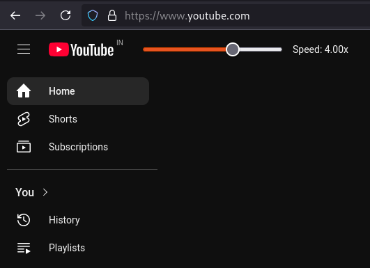
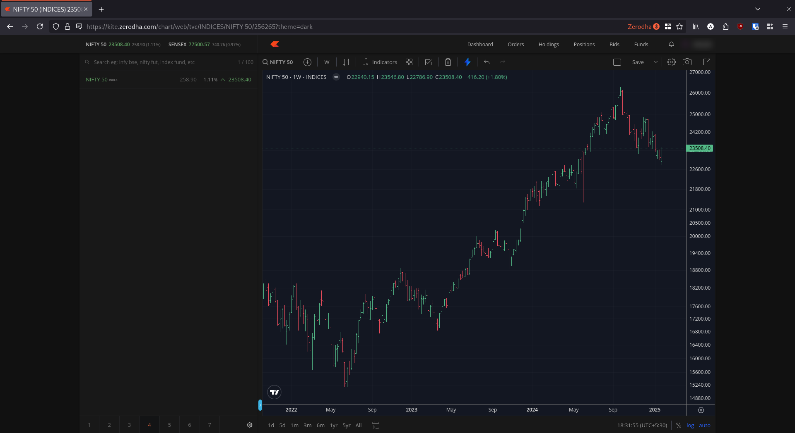
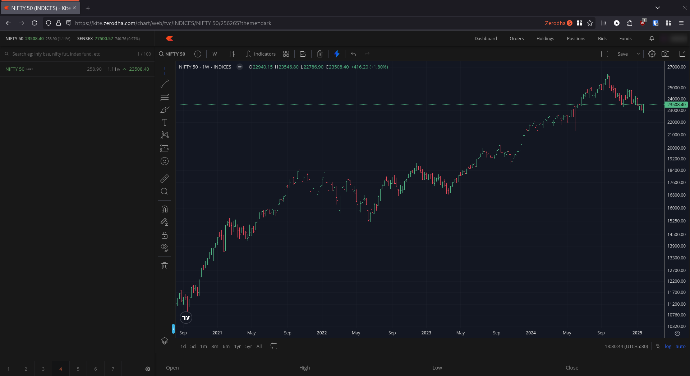

# Collection of useful Browser Userscripts

## [Youtube Custom Speed Slider](https://cdn.jsdelivr.net/gh/codeaditya/browser-userscripts@main/youtube-custom-speed-slider.js)

- Adds a Custom Video Speed slider at the top of the page besides Youtube logo.
- The speed setting is respected for both regular Videos and Shorts.
- Use `+` / `-` as keyboard shortcuts to increase / decrease the speed.

## [Zerodha Kite Use Full Width](https://cdn.jsdelivr.net/gh/codeaditya/browser-userscripts@main/zerodha-kite-use-full-width.js)

- Efficiently utilizes the full width of the screen

**Before:**

**After:**

